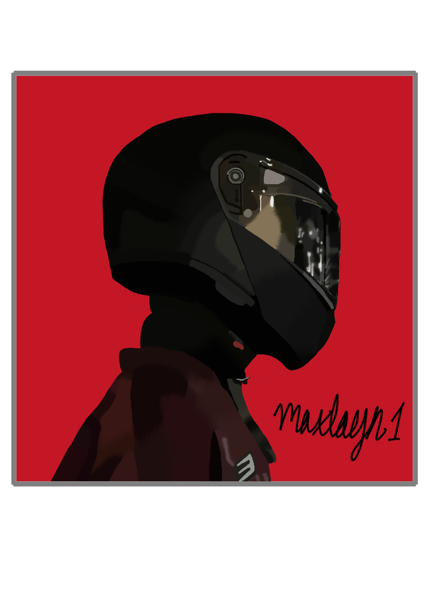
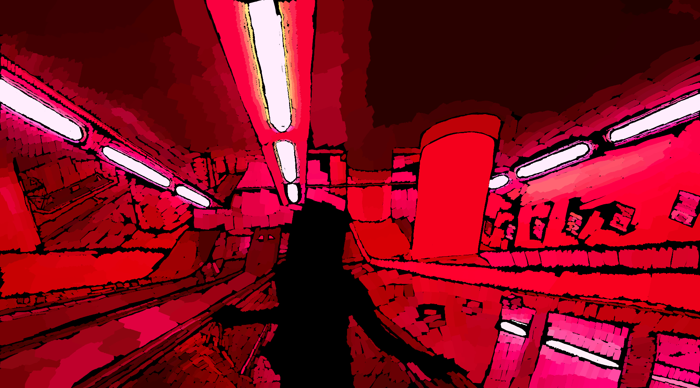

<!--[I think I will add another page with a catalog of my favorite movies and tv shows](./another-page.html).-->

# About me

Hello, my name is Maxim! To tell you a bit about myself, I've been programming in highschool and college for a couple of years. I am currently attending Southern Illinois University Edwardsville. Besides programming, I enjoy weightlifting, making art, and watching movies with my friends. 

# Projects

Various things that I've made:

## News Headline Sentiment Generator

Uses a locally run LLM to evaluate scraped business news headlines as either "positive," "negative," or "neutral." Written in Python and utilizes LLMs, APIs, a webscraper, and unit testing with Pylance. Project is also containerized and uploaded to docker hub. 
[Github repo](https://github.com/maxlayn1/CS325_Project1/tree/FINAL) 
[Dockerhub image](https://hub.docker.com/r/maxlayn1/headline_sentiment_app)

## Fitness Supplement Informative Website

Full stack website offering information about various health supplement. Written in php and utilizes mySQL and phpAdmin for responsive web design and user authentication. 
[Github repo](https://github.com/maxlayn1/FINAL-PROJECT/tree/main)

## D&D Character Stat Sheet Generator App

Contributed to Dungeons and Dragons character stat sheet generator. Makes Github API call to pull character stat texts and parses them at runtime to avoid copyright issues. Utilizes Godot Mono (C# version of Godot) for application interface. Developed at eHacks 2025 in a group. 
[Github repo](https://github.com/Jaz2021/Bouncr)

# Education

Pursuing a bachelor's degree in Computer Science  
Southern Illinois University at Edwardsville, Edwardsville, IL  
Expected graduation date: May 2026 - a year ahead of schedule due to an accelerated course load  
GPA: 3.7/4.0  
Relevant Coursework: Concepts of Computer Science, Introduction to Computing I,
Introduction to Computing II, Database and Web System Development, Introduction to
Computer Organization and Architecture, Statistics for Applications, Linear Algebra I,
Discrete Mathematics, Ethical and Social Implications of Computing, Operating
Systems, Software Engineering

# Some of my art!

